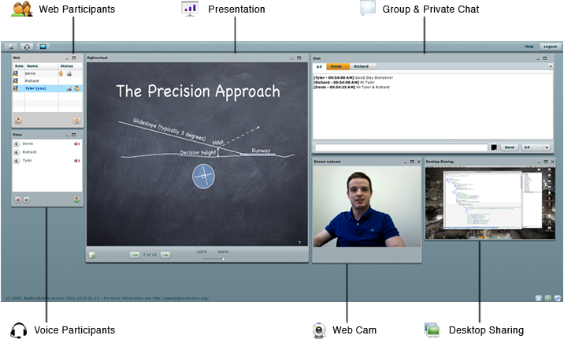

# BigBlueButton, self-hosted web conferencing system for on-line learning

The objective of this use case is to deploy BigBlueButton on a single node, at the [Managed Cloud Platform from Dimension Data](http://cloud.dimensiondata.com/eu/en/).
This is done with [plumbery](https://developer.dimensiondata.com/display/PLUM/Plumbery) and a template that is provided below.

[BigBlueButton](http://bigbluebutton.org/) is an open source web conferencing system for online learning. The goal of the project is to provide remote students a high-quality online learning experience.

BigBlueButton enables real-time sharing of audio, video, presentation (with whiteboard markup), polling, emote icons (including raise hand), chat, and the presenter’s desktop. It is localized into over 35 languages and supports JAWS screen reader.

There are two types of users in a BigBlueButton session: viewer or moderator. A viewer (typically the student) can chat, display an emote icon, and send/receive audio and video. A moderator (typically the instructor) can, in addition to all the capabilities of a viewer, mute/unmute other viewers, lock down viewers, or make anyone (including themselves) the presenter. The current presenter can upload slides, annotate them (using the whiteboard controls), and share his or her desktop for all to see.

In this use case a private BigBlueButton instance is deployed, just for you and for your team.

## Requirements for this use case

There are a number of actions involved in the overall deployment, and plumbery
will assist to orchestrate all of them, except the online setup of iTop:

* Select a MCP location
* Add a Network Domain
* Add an Ethernet network
* Deploy a Ubuntu server
* Adjust computing capacity (CPU and RAM) to provide enough horse power
* Add a virtual disk to support session recording
* Monitor this server in the real-time dashboard provided by Dimension Data
* Assign a public IPv4 address
* Add address translation to ensure end-to-end IP connectivity
* Add firewall rule to accept TCP and UDP traffic from multiple ports
* Expand system logical volume (LVM) with additional virtual disk
* Update the operating system of each node
* Synchronise node clock of each node
* Install a new SSH key to secure remote communications
* Configure SSH to reject passwords and to prevent access from root account
* Update `etc/hosts` to bind addresses to host names
* Update the operating system to last version
* Download and install ffmpeg
* Download and install BigBlueButton
* Finalise the setup

## Fittings plan

[Click here to read fittings.yaml](fittings.yaml)

## Deployment command

    $ python -m plumbery fittings.yaml deploy

This command will build fittings as per the provided plan, start the server
and bootstrap it. Look at messages displayed by plumbery while it is
working, so you can monitor what's happening.

## Follow-up commands

At the end of the deployment, plumbery will display on screen some instructions
to help you move forward. You can ask plumbery to display this information
at any time with the following command:

    $ python -m plumbery fittings.yaml information

Final step is to connect to BigBlueButton in a web browser, and to complete the setup
online.

## Destruction commands

Launch following command to remove all resources involved in the fittings plan:

    $ python -m plumbery fittings.yaml dispose

## Use case status

- [X] Work as expected

## See also

- [Collaboration services with plumbery](../)
- [All plumbery fittings plans](../../)

