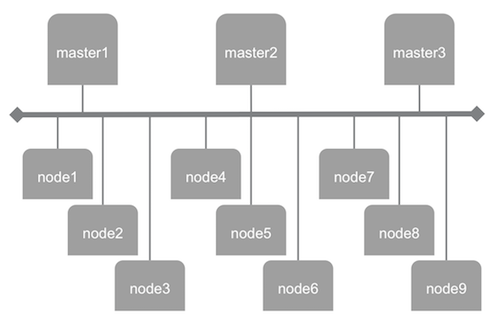
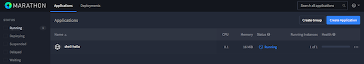
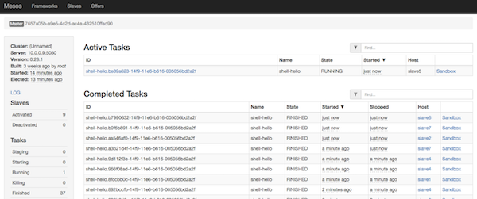
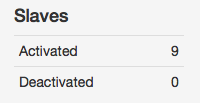
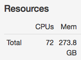

# Mesosphere cluster, with 3 masters and 9 slaves

The objective of this use case is to deploy a large cluster of Mesosphere nodes at the [Managed Cloud Platform from Dimension Data](http://cloud.dimensiondata.com/eu/en/).
This is done with [plumbery](https://developer.dimensiondata.com/display/PLUM/Plumbery) and a template that is provided below.

Mesosphere is a system that combines a number of components to effectively manage server clustering and highly available deployments on top of an existing operating system layer. Unlike systems like CoreOS, Mesosphere is not a specialized operating system and is instead a set of packages.

In this guide, we will go over how to configure a highly available cluster in Mesosphere. This configuration will set us up with failover in case any of our master nodes go down as well as a pool of slave nodes to handle the tasks that are scheduled.

We will be using Ubuntu 14.04 servers for this guide.

## Requirements for this use case

* Select a MCP location
* Add a Network Domain
* Add an Ethernet network
* Deploy 12 Ubuntu nodes -- 3 masters and 9 slaves
* Provide a lot of resources to each slave
* Monitor all nodes in the real-time dashboard provided by Dimension Data
* Assign a public IPv4 address to each node
* Add address translation rules to ensure Internet connectivity with each node
* Add firewall rule to accept TCP traffic on ports 22, 5050 and 8080 to each master
* Add firewall rule to accept TCP traffic on port 22 to each slave
* Update the operating system of each node
* Synchronise node clock of each node
* Install a new SSH key to secure remote communications
* Configure SSH to reject passwords and to prevent access from root account
* Update `etc/hosts` and `hostnames` to bind IPv6 addresses to host names
* Install Mesosphere at all master nodes, and Mesos at all slaves
* Configure Zookeeper, Mesos-master and Marathon at each master node
* Configure Mesos at each slave node
* Restart services to launch the cluster
* Submit a sample job via the API to feed the cluster

## Fittings plan

[Click here to read fittings.yaml](fittings.yaml)

## Deployment command

    $ python -m plumbery fittings.yaml deploy

This command will build fittings as per the provided plan, start nodes
and bootstrap them. Look at messages displayed by plumbery while it is
working, so you can monitor what's happening.

## Follow-up commands

At the end of the deployment, plumbery will display on screen some instructions
to help you move forward. You can ask plumbery to display this information
at any time with the following command:

    $ python -m plumbery fittings.yaml information

To check the orchestration of activities you can go to any Marathon web interface:

    http://<ipv4_of_one_master_here>:8080

This will show how Marathon is managing the job that was submitted during the
setup of the full cluster.

To get more information you can check the Mesos cluster from web access to one master node.

    http://<ipv4_of_one_master_here>:5050

The targeted master may redirect you to the current leading master of the cluster.

From there you can check on the left part of the screen how many slaves have registered to the cluster:

Also, the total quantity of shared resources is shown on screen:

To get additional information about each of your slave machines,
you can click on the "Slaves" link at the top of the interface.
This will give you an overview of each machine's resource contribution,
as well as links to a page for each slave.

## Destruction commands

Launch following command to remove all resources involved in the fittings plan:

    $ python -m plumbery fittings.yaml dispose

## Use case status

- [x] Work as expected

## See also

- [Containers with plumbery](../)
- [All plumbery fittings plan](../../)

