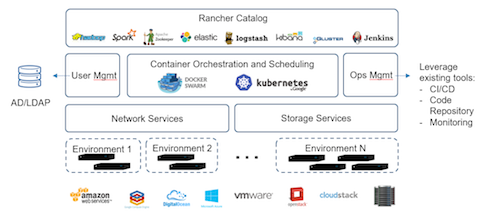
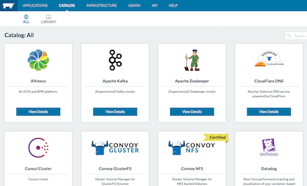
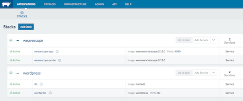

# Rancher, a complete platform for running containers

The objective of this use case is to deploy Rancher on a single node, at the [Managed Cloud Platform from Dimension Data](http://cloud.dimensiondata.com/eu/en/).
This is done with [plumbery](https://developer.dimensiondata.com/display/PLUM/Plumbery) and a template that is provided below.

[Rancher](http://rancher.com/) is an open source software platform that implements a purpose-built infrastructure for running containers in production. Docker containers, as an increasingly popular application workload, create new requirements in infrastructure services such as networking, storage, load balancer, security, service discovery, and resource management.

In this use case we demonstrate how to create a large Docker node and deploy
Rancher on it. Then you can access the web interface of Rancher to let it go.

## Requirements for this use case

* Select a MCP location
* Add a Network Domain
* Add an Ethernet network
* Deploy a large Ubuntu server
* Provide 32 CPU and 256 MB of RAM to each node
* Add a virtual disk of 1000 GB
* Monitor this server in the real-time dashboard provided by Dimension Data
* Assign a public IPv4 address
* Add address translation to ensure end-to-end IP connectivity
* Add firewall rule to accept TCP traffic on port 22, 80, 4040 and 8080
* Combine the virtual disks into a single expanded logical volume (LVM)
* Update the operating system of each node
* Synchronise node clock of each node
* Install a new SSH key to secure remote communications
* Configure SSH to reject passwords and to prevent access from root account
* Update `etc/hosts` and `hostnames` to bind IPv6 addresses to host names
* Install Docker
* Allow non-root account to use Docker
* Install Rancher as a Docker container

## Fittings plan

[Click here to read fittings.yaml](fittings.yaml)

## Deployment command

    $ python -m plumbery fittings.yaml deploy

This command will build fittings as per the provided plan, start the server
and bootstrap it. Look at messages displayed by plumbery while it is
working, so you can monitor what's happening.

## Follow-up commands

At the end of the deployment, plumbery will display on screen some instructions
to help you move forward. You can ask plumbery to display this information
at any time with the following command:

    $ python -m plumbery fittings.yaml information

To reach Rancher and initiate setup, use your favorite web browser:

    http://<ipv4_here>:8080

From there you can access the Catalog and install some applications.

We suggest that you start with Wordpress and WeaveScope, as in following screenshot.

If you want to look at how Rancher handles Docker containers directly you can use ssh as well:

    $ ssh ubuntu@<ipv4_here>

## Destruction commands

Launch following command to remove all resources involved in the fittings plan:

    $ python -m plumbery fittings.yaml dispose

## Use case status

- [x] Work as expected

## See also

- [Containers with plumbery](../)
- [All plumbery fittings plans](../../)

