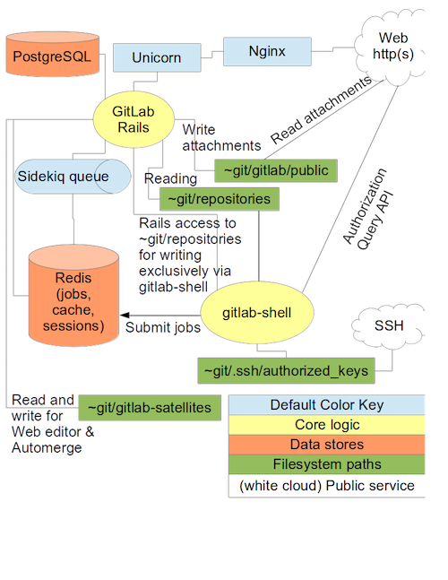

# GitLab Community Edition and Samba server, core internal services for developers

The objective of this use case is to deploy core private services for developers, at the [Managed Cloud Platform from Dimension Data](http://cloud.dimensiondata.com/eu/en/).
This is done with [plumbery](https://developer.dimensiondata.com/display/PLUM/Plumbery) and a template that is provided below.

GitLab includes Git repository management, code reviews, issue tracking, wikis, and more, plus GitLab CI, an easy-to-use continuous integration and deployment tool.

Collaborate with your team using issues, milestones, and line-by-line code review. View activity streams of projects or the people you work with.

GitLab seamlessly integrates with Slack, Hipchat, LDAP, JIRA, Jenkins, and many other popular tools. GitLab includes many webhooks and offers a complete API.

Samba is added to allow for easy file sharing among software developers.

## Requirements for this use case

* Select a MCP location
* Add a Network Domain
* Add an Ethernet network
* Deploy a CentOS node with 2 CPU and 4 GB of RAM
* Add a virtual disk of 500 GB
* Monitor this server in the real-time dashboard provided by Dimension Data
* Assign a public IPv4 address
* Add address translation to ensure end-to-end IP connectivity
* Add firewall rule to accept TCP traffic on ports ssh, http and samba
* Combine the virtual disks into a single expanded logical volume (LVM)
* Update the operating system
* Synchronise node clock with NTP
* Install a new SSH key to secure remote communications
* Configure SSH to reject passwords and to prevent access from root account
* Install GitLab and Samba

## Fittings plan

[Click here to read fittings.yaml](fittings.yaml)

## Deployment command

    $ python -m plumbery fittings.yaml deploy

This command will build fittings as per the provided plan, start the server
and bootstrap it. Look at messages displayed by plumbery while it is
working, so you can monitor what's happening.

## Follow-up commands

At the end of the deployment, plumbery will display on screen some instructions
to help you move forward. You can ask plumbery to display this information
at any time with the following command:

    $ python -m plumbery fittings.yaml information

Open a browser window and paste the public address reported by plumbery.
You should receive a login page in return.

## Destruction commands

Launch following command to remove all resources involved in the fittings plan:

    $ python -m plumbery fittings.yaml dispose

## Use case status

- [ ] Work as expected

## See also

- [DevOps services with plumbery](../)
- [All plumbery fittings plans](../../)

