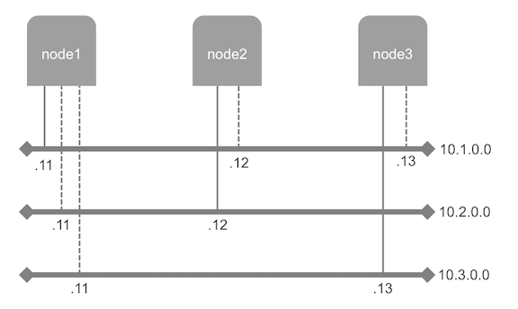

# Multiple network interfaces

The objective of this use case is to deploy nodes with multiple network interfaces, at the [Managed Cloud Platform from Dimension Data](http://cloud.dimensiondata.com/eu/en/).
This is done with [plumbery](https://developer.dimensiondata.com/display/PLUM/Plumbery) and a template that is provided below.

In this use case three networks are deployed within the same domain.
Three nodes are deployed, each having a primary interface on a separate network.
Additional network interfaces are added to nodes so that they can talk to each other directly.

The layout is making extensive use of static IPv4 addresses, that are used by plumbery both for the
setup of the infrastructure and for the configuration of each node. This example shows also
how to finalise the network configuration of Ubuntu nodes.

## Requirements for this use case

* Select a MCP location
* Add a Network Domain
* Add 3 Ethernet networks: PrimaryNetwork, SecondaryNetwork and TertiaryNetwork
* Deploy a node on PrimaryNetwork
* Deploy a node on SecondaryNetwork
* Deploy a node on TertiaryNetwork
* Monitor servers in the real-time dashboard provided by Dimension Data
* Assign a public IPv4 address to each node, and add address translation
* Add firewall rule to accept TCP traffic on port 22 (ssh)
* Add network interfaces to the first node so that it is plugged also in SecondaryNetwork and in TertiaryNetwork
* Add a network interface to the second node so that it is attached to PrimaryNetwork
* Add a network interface to the third node so that it is attached to PrimaryNetwork
* Update the operating system
* Synchronise node clock with NTP
* Add package ethtool to troubleshoot network sub-system eventually
* Install a new SSH key to secure remote communications
* Configure SSH to reject passwords and to prevent access from root account

## Fittings plan

[Click here to read fittings.yaml](fittings.yaml)

## Deployment command

    $ python -m plumbery fittings.yaml deploy

This command will build fittings as per the provided plan, start the server
and bootstrap it. Look at messages displayed by plumbery while it is
working, so you can monitor what's happening.

## Follow-up commands

At the end of the deployment, plumbery will display on screen some instructions
to help you move forward. You can ask plumbery to display this information
at any time with the following command:

    $ python -m plumbery fittings.yaml information

In this use case you can use the IPv4 assigned to nodes for direct ssh
connection.

    $ ssh ubuntu@<ipv4_here>

You will have to accept the new host, and authentication will be based on
the SSH key communicated to the node by Plumbery.

    $ ifconfig -a

Command is self-explanatory and validate networks deployment and configuration.

## Destruction commands

Launch following command to remove all resources involved in the fittings plan:

    $ python -m plumbery fittings.yaml dispose

## Use case status

- [X] Work as expected

## See also

- [Example configurations with plumbery](../)
- [All plumbery fittings plans](../../)

