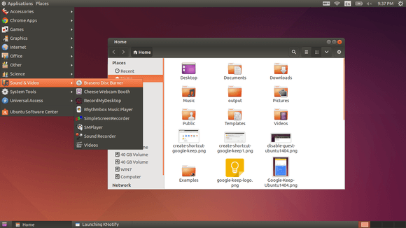

# Ubuntu desktop

The objective of this use case is to deploy a Stackstorm server, at the [Managed Cloud Platform from Dimension Data](http://cloud.dimensiondata.com/eu/en/).
This is done with [plumbery](https://developer.dimensiondata.com/display/PLUM/Plumbery) and a template that is provided below.

## Requirements for this use case

* Select a MCP location
* Add a Network Domain
* Add an Ethernet network
* Deploy a Ubuntu node
* Provide 2 CPU and 8 GB of RAM
* Add a virtual disk of 50 GB
* Monitor this server in the real-time dashboard provided by Dimension Data
* Assign a public IPv4 address
* Add address translation to ensure end-to-end IP connectivity
* Add firewall rule to accept TCP traffic on port 22 (ssh), 5901 (vnc)
* Combine the virtual disks into a single expanded logical volume (LVM)
* Update the operating system
* Synchronise node clock with NTP
* Install a new SSH key to secure remote communications
* Configure SSH to reject passwords and to prevent access from root account
* Install Ubuntu gnome-based desktop
* Install VNC server and generate random secret password
* Configure VNC as a service

## Fittings plan

Some interesting remarks on this fittings plan:

**expect** - The password used by VNC server is normally entered interactively.
Here the package ``expect`` has been added, with a little script, to automate
this interactivity. This is a very powerful mechanism that can be useful
in various situations.

**Service installation** - The VNC server is installed as an ordinary service via an additional command
in `/etc/init.d/` and  with `update-rc.d`

**Infrastructure documentation** - The ``information:`` directive provides
comprehensive instructions to finalise the setup. This is displayed at the end
of the command ``deploy``. It can also be retrieved unattended with the
command ``information``.

[Click here to read fittings.yaml](fittings.yaml)

## Deployment command

    $ python -m plumbery fittings.yaml deploy

This command will build fittings as per the provided plan, start the server
and bootstrap it. Look at messages displayed by plumbery while it is
working, so you can monitor what's happening.

## Follow-up commands

At the end of the deployment, plumbery will display on screen some instructions
to help you move forward. You can ask plumbery to display this information
at any time with the following command:

    $ python -m plumbery fittings.yaml information

You need a VNC viewer on your computer to make it work. As a starting
point you can attempt to enter the following URL in a browser window::

    vnc://127.0.0.1:5901

## Destruction commands

Launch following command to remove all resources involved in the fittings plan:

    $ python -m plumbery fittings.yaml dispose

## Use case status

- [ ] Work as expected

## See also

- [Example configurations with plumbery](../)
- [All plumbery fittings plans](../../)

