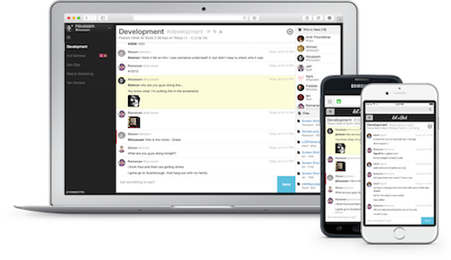

# Let's Chat server

[Let's Chat](https://sdelements.github.io/lets-chat/) is a persistent messaging application that runs on Node.js and MongoDB.
It's designed to be easily deployable and fits well with small, intimate teams. It's free (MIT licensed) and ships with killer features such as LDAP/Kerberos authentication, a REST-like API and XMPP support.

In this use case we demonstrate how to create a ready-to-use [Let's Chat](https://sdelements.github.io/lets-chat/) server
on a single node at the [Managed Cloud Platform from Dimension Data](http://cloud.dimensiondata.com/eu/en/).
This is done with [plumbery](https://developer.dimensiondata.com/display/PLUM/Plumbery) and a template that is provided below.

## Requirements for this use case

* Go to a MCP location
* Add a Network Domain
* Add an Ethernet network
* Deploy a Ubuntu server
* Provide 8 CPU and 32 MB of RAM
* Add a virtual disk of 50 GB
* Monitor this server in the real-time dashboard
* Assign a public IPv4 address
* Add address translation to ensure end-to-end IP connectivity
* Add firewall rule to accept TCP traffic on port 22 (ssh) and 5000 (web)
* Use the virtual disk to expand logical volume (LVM)
* Edit the host name and the `/etc/hosts` file
* Install a new SSH key to secure remote communications
* Configure SSH to reject passwords and to prevent access from root account
* Install Let's Chat
* Launch it

## Fittings plan

[Click here to read fittings.yaml](fittings.yaml)

## Deployment command

    $ python -m plumbery fittings.yaml deploy

This command will build fittings as per the provided plan, start the server
and bootstrap it.

## Follow-up commands

You can find the public address assigned to the Let's Chat node like this:

    $ python -m plumbery fittings.yaml information

Copy the web link into some browser to access the server and to start a
discussion.

Share the link with people around you so that you can chat together.

Note: if you have registered your email address to gravatar, then your face
will appear automatically in Let's Chat.

## Destruction commands

Launch following command to remove all resources involved in the fittings plan:

    $ python -m plumbery fittings.yaml dispose

## Use case status

- [x] Work as expected
- [ ] Add Hubot to get interactive feedback while demonstrating the chat

