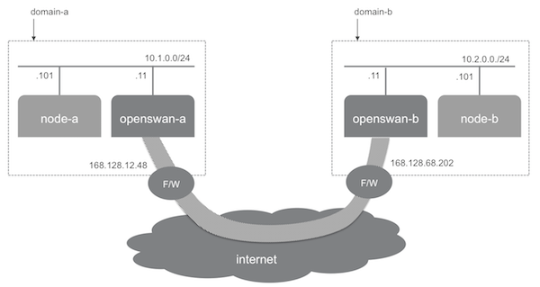

# Site-to-site IPsec tunnel with Openswan

The objective of this use case is to create a secured tunnel across 2 Network Domains with openswan, at the [Managed Cloud Platform from Dimension Data](http://cloud.dimensiondata.com/eu/en/).
This is done with [plumbery](https://developer.dimensiondata.com/display/PLUM/Plumbery) and a template that is provided below.

The objective here is to connect privately two Network Domains over the Internet. For this an IPsec tunnel is put in place between two openswan endpoints. On the diagram above, end-to-end connectivity is provided between node-a and node-b, through the tunnel.

[Openswan](https://www.openswan.org/) is an IPsec implementation for Linux. It has support for most of the extensions (RFC + IETF drafts) related to IPsec, including IKEv2, X.509 Digital Certificates, NAT Traversal, and many others.

## Requirements for this use case

* Select a first MCP location
* Add a Network Domain -- domain-a
* Add an Ethernet network
* Deploy 2 nodes: node-a and openswan-a
* Adjust the amount of resources given to each node
* Select a second MCP location
* Add a Network Domain -- domain-b
* Add an Ethernet network
* Deploy 2 nodes: node-b and openswan-b
* Adjust the amount of resources given to each node
* Monitor all nodes in the real-time dashboard provided by Dimension Data
* Assign public IPv4 addresses to each node
* Add address translation to ensure end-to-end IP connectivity
* Add firewall rule to accept ssh traffic, and IPsec traffic on openswan nodes
* On each openswan node: remove Apache, install and configure openswan
* On other nodes: add a route via openswan gateways
* Update the operating system everywhere
* Synchronise nodes clock
* Install new SSH keys to secure remote communications
* Configure SSH to reject passwords and to prevent access from root account

## Fittings plan

[Click here to read fittings.yaml](fittings.yaml)

## Deployment command

    $ python -m plumbery fittings.yaml deploy

This command will build fittings as per the provided plan, start the server
and bootstrap it. Look at messages displayed by plumbery while it is
working, so you can monitor what's happening.

## Follow-up commands

At the end of the deployment, plumbery will display on screen some instructions
to help you move forward. You can ask plumbery to display this information
at any time with the following command:

    $ python -m plumbery fittings.yaml information

To validate that the architecture is working as expected, you can connect to
node-a:

    $ ssh ubuntu@<ip_address_of_node-a>

From there you can ping node-b and connect to it remotely:

    $ ping -c 5 node-b
    $ ssh ubuntu@node-b

Of course, you can also connect to node-b first, and then from there
connect to node-a remotely.

## Destruction commands

Launch following command to remove all resources involved in the fittings plan:

    $ python -m plumbery fittings.yaml dispose

## Use case status

- [X] Work as expected

## See also

- [Networking services with plumbery](../)
- [All plumbery fittings plans](../../)

