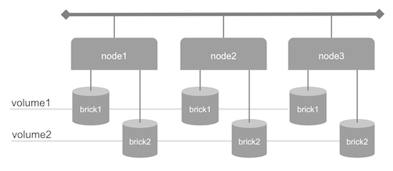

# GlusterFS cluster of 3 nodes

The objective of this use case is to deploy a cluster of GlusterFS nodes at the [Managed Cloud Platform from Dimension Data](http://cloud.dimensiondata.com/eu/en/).
This is done with [plumbery](https://developer.dimensiondata.com/display/PLUM/Plumbery) and a template that is provided below.

The cluster is built out of 3 GlusterFS nodes with 2 storage bricks each. Two logical storage volumes are spread over the cluster. Storage assigned to each brick can be changed by passing parameters to plumbery.

## Requirements for this use case

* Select a MCP location
* Add a Network Domain
* Add an Ethernet network
* Deploy multiple CentOS nodes
* Tune CPU and RAM of each node
* Add 2 virtual disks to each node -- the "bricks"
* Monitor all nodes in the real-time dashboard provided by Dimension Data
* Assign a public IPv4 address to each node
* Add address translation rules to ensure Internet connectivity with each server
* Add firewall rule to accept TCP traffic on ssh to each node
* Use LVM to create a separate brick for each node of the cluster
* Update the operating system of each node
* Synchronise node clock of each node
* Install a new SSH key to secure remote communications
* Configure SSH to reject passwords and to prevent access from root account
* Update `etc/hosts` and `hostnames` to bind IPv6 addresses to host names
* Install GlusterFS at each node
* Configure the cluster to allow for data replication across nodes

## Fittings plan

[Click here to read fittings.yaml](fittings.yaml)

## Deployment command

    $ python -m plumbery fittings.yaml deploy

This command will build fittings as per the provided plan, start nodes
and bootstrap them. Look at messages displayed by plumbery while it is
working, so you can monitor what's happening.

## Follow-up commands

At the end of the deployment, plumbery will display on screen some instructions
to help you move forward. You can ask plumbery to display this information
at any time with the following command:

    $ python -m plumbery fittings.yaml information

In this use case you can use the IPv4 assigned to the manager for direct ssh
connection.

    $ ssh centos@<ipv4_of_one_node>

From there you will check both the status of the Ceph cluster:

    $ gluster volume info
    $ gluster peer status

## Destruction commands

Launch following command to remove all resources involved in the fittings plan:

    $ python -m plumbery fittings.yaml dispose

## Use case status

- [ ] Work as expected

## See also

- [Storage with plumbery](../)
- [All plumbery fittings plan](../../)

