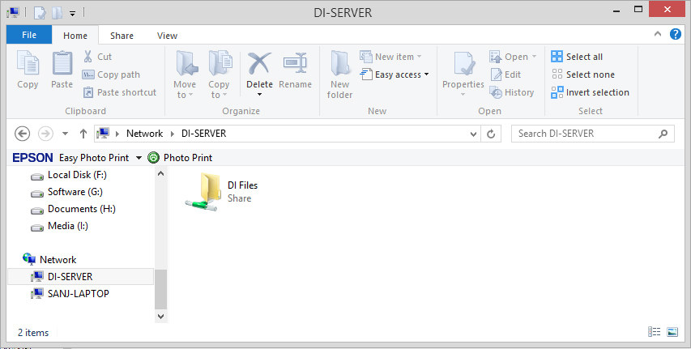

# Samba file sharing server

In this use case we deploy a Samba file server, at the [Managed Cloud Platform from Dimension Data](http://cloud.dimensiondata.com/eu/en/).
This is done with [plumbery](https://developer.dimensiondata.com/display/PLUM/Plumbery) and a template that is provided below.

[Samba](https://www.samba.org/) is the standard Windows interoperability suite of programs for Linux and Unix.
Since 1992, Samba has provided secure, stable and fast file and print services for all clients using the SMB/CIFS protocol, such as all versions of DOS and Windows, OS/2, Linux and many others.

## Requirements for this use case

* Select a MCP location
* Add a Network Domain
* Add an Ethernet network
* Deploy a Ubuntu server
* Provide 2 CPU and 4 MB of RAM
* Add a virtual disk of 50 GB
* Monitor this server in the real-time dashboard provided by Dimension Data
* Assign a public IPv4 address
* Add address translation to ensure end-to-end IP connectivity
* Add firewall rule to accept TCP traffic on port 22 (ssh) and 80 (web)
* Combine virtual disks into a single expanded logical volume (LVM)
* Update the operating system
* Synchronise node clock
* Install a new SSH key to secure remote communications
* Configure SSH to reject passwords and to prevent access from root account
* Add firewall rule to accept TCP traffic on ports 22 (ssh), 139 and 445
* Remove Apache
* Add samba to the server and configure it

## Fittings plan

[Click here to read fittings.yaml](fittings.yaml)

## Deployment command

    $ python -m plumbery fittings.yaml deploy

This command will build fittings as per the provided plan, start the server
and bootstrap it. Look at messages displayed by plumbery while it is
working, so you can monitor what's happening.

## Follow-up commands

At the end of the deployment, plumbery will display on screen some instructions
to help you move forward. You can ask plumbery to display this information
at any time with the following command:

    $ python -m plumbery fittings.yaml information

TO BE COMPLETED

## Destruction commands

Launch following command to remove all resources involved in the fittings plan:

    $ python -m plumbery fittings.yaml dispose

## Use case status

- [ ] Work as expected

## See also

- [Storage services with plumbery](../)
- [All plumbery fittings plans](../../)

